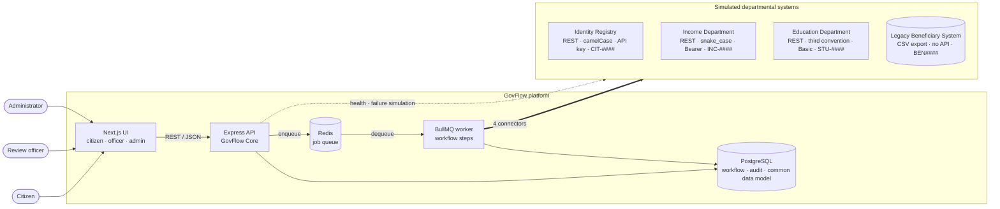
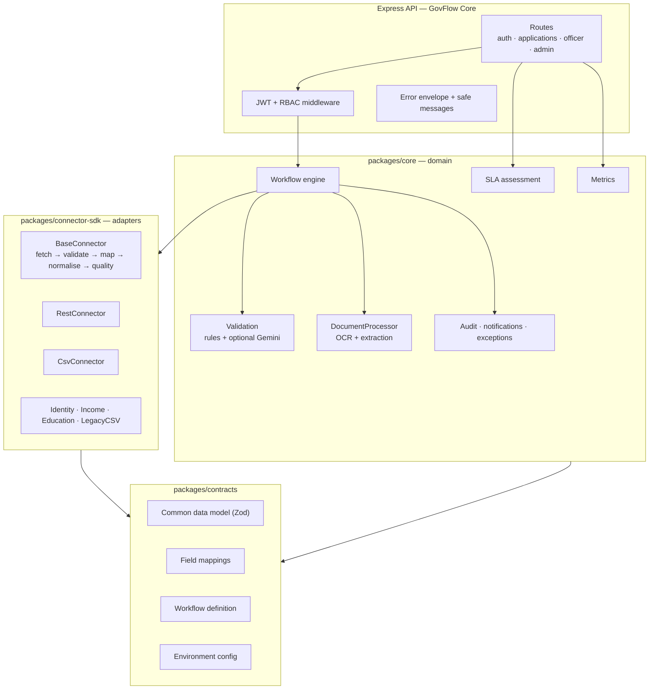
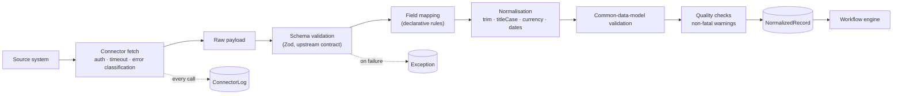
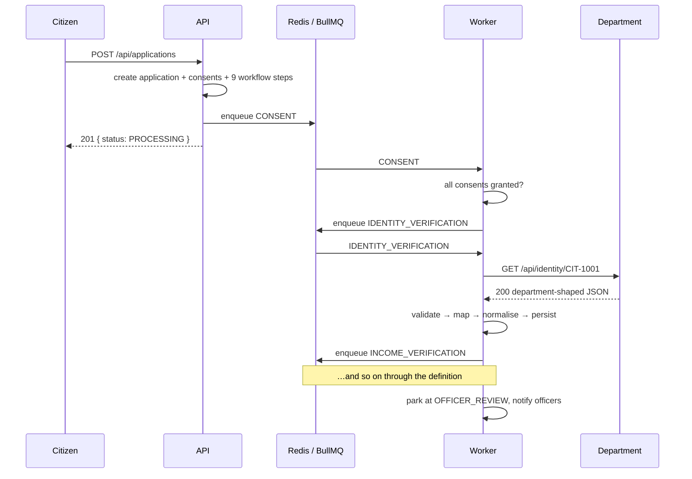
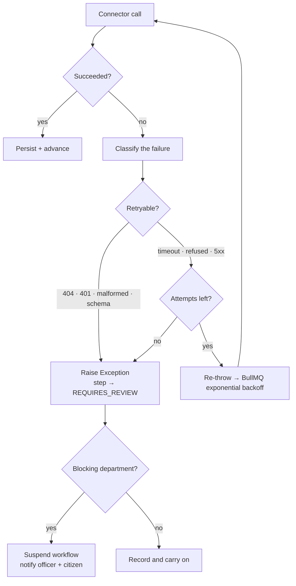
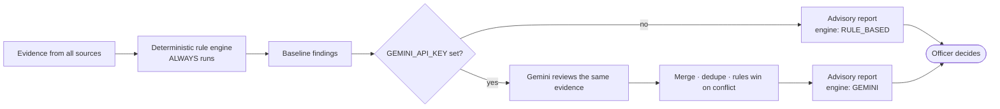
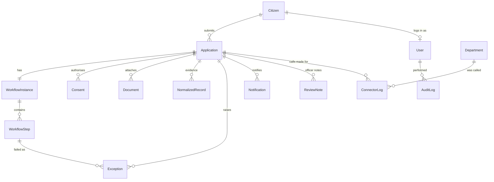

# GovFlow — Architecture

> **Prototype.** Every "department" in this document is a simulated service holding
> synthetic data. No real government registry is connected.

## 1. The problem

Departments build independently. Over time each ends up with its own portal, its own
registry, its own identifiers, its own API conventions and its own authentication. The
citizen pays for that fragmentation: the same information is submitted repeatedly,
verification happens by email and phone call, and nobody can say where an application
actually is.

The instinct is to build one big new system that replaces them. That is a decade-long
programme with a poor success record, and it requires every department to give up
ownership of its own data.

## 2. The approach — connect, don't replace

GovFlow is **middleware**, not a replacement. It sits between the citizen and the
departments and does five things:

| Concern | How GovFlow handles it |
|---|---|
| Different schemas | A **connector** per department + a declarative **field mapping** |
| Different identifiers | An identifier **crosswalk** (`CIT-1001` ⇄ `INC-1001` ⇄ `STU-1001`) |
| Different auth | Each connector carries its own scheme (API key / bearer / basic / file) |
| Different processes | One **workflow engine** orchestrating steps across departments |
| No shared visibility | One **common data model**, one timeline, one audit log |

Departments keep their systems and their ownership. Onboarding a new one means adding a
connector and a mapping — a configuration change, not a migration.

## 3. System context

## 4. Internal architecture

**The dependency rule that matters:** department-specific schemas exist only inside
`connector-sdk` and the mappings in `contracts`. Nothing in `core` — not the workflow
engine, not the validators, not the dashboards — ever references `applicant_id` or
`student_no`. They see only the common data model.

## 5. The ingestion pipeline

Every department, REST or CSV, goes through exactly the same stages:

A worked example — three registries, three dialects, one result:

| Identity Registry | Income Department | Education Department | → Common data model |
|---|---|---|---|
| `citizenId` | `applicant_id` | `student_no` | `citizenId` |
| `fullName` | `name` | `studentName` | `name` |
| `dob: "2003-05-12"` | — | — | `dateOfBirth` |
| `district: "  KOLHAPUR "` | — | — | `district: "Kolhapur"` |
| — | `annualIncome: "1,95,000"` | — | `annualIncome: 195000` |
| — | — | `enrollment_status: "active"` | `educationStatus: "ACTIVE"` |

## 6. Asynchronous execution

`POST /api/applications` returns in milliseconds with `PROCESSING`. It does **not** call
any department on the request thread — a slow registry must never become a slow portal.

Each step is one job. The engine persists the outcome and enqueues the next step itself,
so the chain is restartable from the database alone.

## 7. Failure handling

Two decisions worth calling out:

- **Retryable vs not** is decided once, in the connector, and expressed as a single
  boolean. Callers never inspect HTTP status codes.
- **Blocking vs non-blocking** is per department. The legacy CSV cross-check is
  non-blocking: its absence degrades the evidence, it does not stop the application.

## 8. Consent

No department is contacted without a recorded, purpose-bound consent. The consent step is
the first workflow step, and it is a genuine gate — with consent outstanding, the workflow
suspends and zero connector calls are made. Granting the last outstanding scope releases it.

## 9. AI as an assistant, never a decision-maker

The rule engine is the floor, not the fallback: it runs whether or not a key is present.
Gemini can add observations and a better summary; it can never remove a rule finding,
and no code path lets any model set an application to `APPROVED` or `REJECTED`.
`recordOfficerDecision` requires an officer user id.

## 10. Data model

Raw department payloads are deliberately **not** persisted in full — only the normalised
record, its provenance and its quality warnings. Audit entries carry identifiers,
statuses and counts, never document contents or credentials.

## 11. Deliberate non-goals

Rejected as wrong for a prototype of this size: Kubernetes, Kafka, a microservice per
department, GraphQL, a second database, and a separate metrics stack. Each would add
operational surface without making the interoperability argument any stronger. The
monitoring dashboards are backed by the same Postgres tables that hold the workflow state.

## 12. Path to production

What would actually have to change:

- Replace simulated departments with real integrations — the connector contract does not change.
- Real identity assurance (the crosswalk currently assumes a shared numeric suffix).
- Consent as a legal artefact: signed receipts, expiry enforcement, revocation propagation.
- Secrets in a managed vault; per-department mTLS or signed requests.
- Horizontal workers, a dead-letter queue, and idempotency keys on department calls.
- Data retention and residency policy for `NormalizedRecord` and `AuditLog`.
