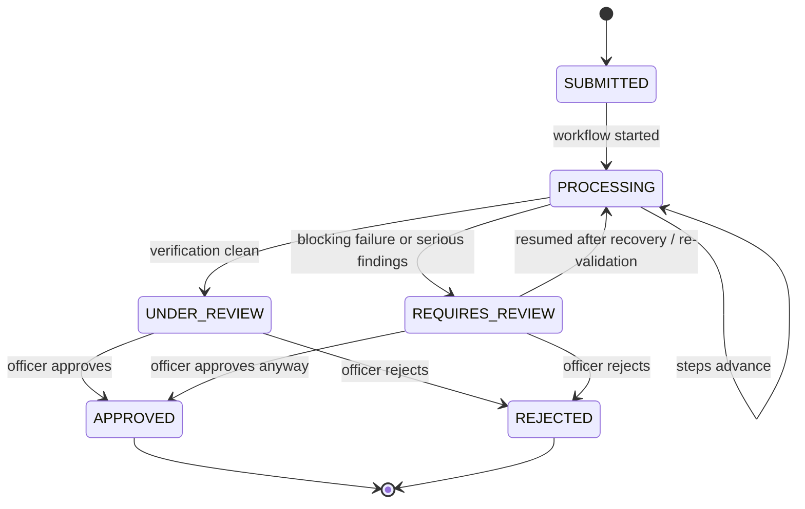
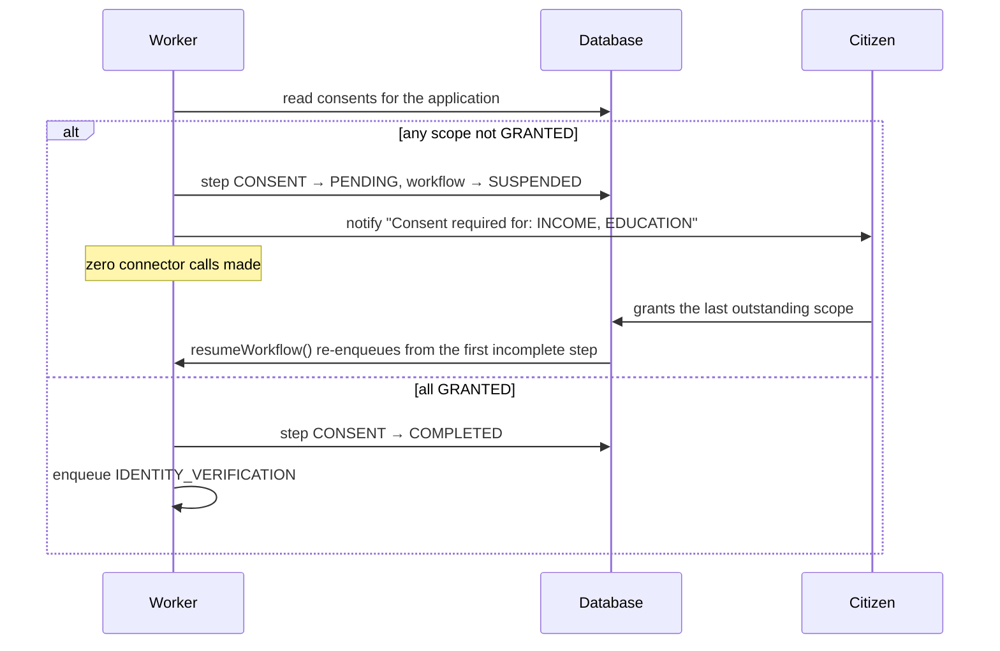

# GovFlow — Workflow reference

The scholarship workflow is defined once, declaratively, in
`packages/contracts/src/workflow.ts`. The engine walks that definition; the UI renders it.
Neither hard-codes a step list.

## The nine steps

| # | Step | Department | Consent required | Automated | Blocking |
|---|---|---|---|---|---|
| 1 | Consent verification | — | — | yes | yes |
| 2 | Identity verification | IDENTITY | IDENTITY | yes | yes |
| 3 | Income verification | INCOME | INCOME | yes | yes |
| 4 | Education verification | EDUCATION | EDUCATION | yes | yes |
| 5 | Legacy beneficiary cross-check | LEGACY | INCOME | yes | **no** |
| 6 | Document validation | — | — | yes | yes |
| 7 | Data quality & mismatch detection | — | — | yes | yes |
| 8 | Officer review | — | — | **no** | — |
| 9 | Final decision | — | — | **no** | — |

Steps 8 and 9 are the human ones. Nothing automated can complete them.

## Step statuses

| Status | Meaning |
|---|---|
| `PENDING` | Not started, or parked waiting on the citizen |
| `IN_PROGRESS` | Currently executing |
| `RETRYING` | Failed, attempts remain, BullMQ is backing off |
| `COMPLETED` | Finished successfully |
| `FAILED` | Finished unsuccessfully, non-blocking |
| `REQUIRES_REVIEW` | Needs a human — retries exhausted, or awaiting the officer |
| `REJECTED` | Terminal, decided against |
| `SKIPPED` | Not applicable to this application |

## Application statuses



`APPROVED` and `REJECTED` are terminal. `recordOfficerDecision` refuses to act on an
application that already holds one, and returns `409 CONFLICT`.

## The consent gate



This is testable and tested: with consent outstanding, `ConnectorLog` and
`NormalizedRecord` are both empty for that application.

## Retry policy

Configured by `WORKFLOW_MAX_ATTEMPTS` (default 3) and `WORKFLOW_BACKOFF_MS` (default 1500),
applied as BullMQ exponential backoff — roughly 1.5s, then 3s, then 6s.

| Failure | Kind | Retryable |
|---|---|---|
| Connection refused | `CONNECTION_REFUSED` | yes |
| Timeout | `TIMEOUT` | yes |
| HTTP 5xx | `UPSTREAM_SERVER_ERROR` | yes |
| CSV export missing | `SOURCE_UNAVAILABLE` | yes |
| HTTP 404 | `NOT_FOUND` | no |
| HTTP 401 / 403 | `UNAUTHORIZED` | no |
| HTTP 4xx | `BAD_REQUEST` | no |
| Body is not JSON, or breaks the published contract | `MALFORMED_RESPONSE` | no |
| Mapping cannot fill a required field | `SCHEMA_VALIDATION` | no |

Retrying a 404 or a schema violation would only waste the window before a human sees it,
so those raise an exception on the first attempt.

## What happens when retries run out

1. Step → `REQUIRES_REVIEW`, with `retryCount` and the error message persisted.
2. An `Exception` row is created (`CONNECTOR_FAILURE`, severity `HIGH` for a blocking
   department, `LOW` for a non-blocking one).
3. Officers and admins are notified in-app; the citizen gets a plain-language delay notice.
4. If the department is **blocking**, the workflow suspends and the application becomes
   `REQUIRES_REVIEW`. If **non-blocking**, the failure is recorded and the chain continues.

Recovery: restore the department, then `POST /api/officer/applications/:id/resume`, which
re-queues the first step that has not completed.

## Re-validation

Uploading a document after the automated passes have already run does not leave the new
evidence unnoticed. `revalidateApplication` resets `DOCUMENT_VALIDATION` and
`DATA_QUALITY_CHECK` to `PENDING`, marks the previous mismatch/missing-document exceptions
as superseded, and re-queues. The fresh run re-raises whatever still applies, so the
officer's queue reflects the current state of the file rather than its history.

## SLA

Deterministic, no prediction model.

```
targetHours = slaTargetDays × 24          (default 5 days)
consumed    = elapsedHours / targetHours

consumed ≥ 1.0                → OVERDUE
consumed ≥ 0.7                → AT_RISK
open exception present        → at least AT_RISK
awaiting officer & consumed ≥ 0.5 → at least AT_RISK
otherwise                     → ON_TRACK
```

A decision stops the clock; the assessment then reports whether the decision itself
landed inside the target.

## Extending the workflow

To add a department:

1. Add a `DepartmentDefinition` to `packages/contracts/src/departments.ts` (endpoint, auth,
   identifier prefix, blocking or not).
2. Add a `FieldMappingSpec` in `packages/contracts/src/mapping.ts`.
3. Add a connector class in `packages/connector-sdk/src/connectors.ts` — in practice a raw
   schema and any quality checks; everything else is inherited.
4. Add a step to `SCHOLARSHIP_WORKFLOW`.

No change is needed in the workflow engine, the API, or the UI.
